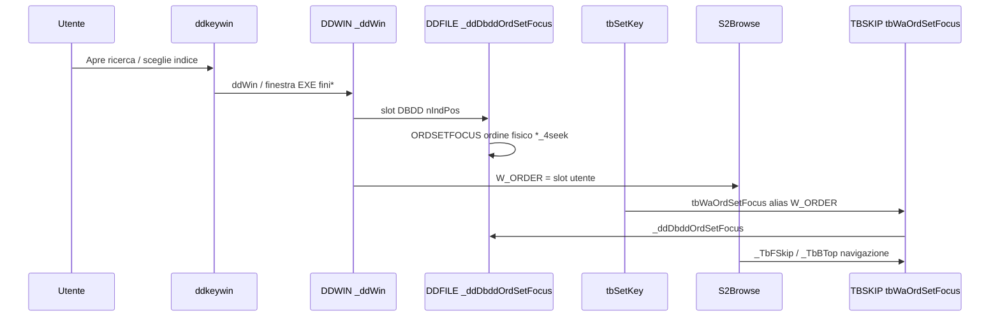

# PGDBE — Browse ricerca: ordine indice e navigazione nativa

**Stato:** maggio 2026, branch `pg`  
**Commit principali:** `cb50a65` (seek/ddKey parziale), `fcb8937` (browse ricerca + rimozione layer custom + build)  
**Perimetro codice:** solo `libreria/`; le applicazioni host che usano la libreria non richiedono modifiche `.prg` per l’ordine indice (solo aggiornamento DLL e eventuale `dbstart.ini`).

---

## 1. Problema osservato

### 1.1 Sintomi su PGDBE

| Comportamento | Spesso OK | Spesso errato su PG |
|---------------|-----------|---------------------|
| Record corrente dopo seek / `dfS` | Sì | — |
| Prime righe della griglia in finestre ricerca (`fini*`, EXE da DBDD, `ddKey` → `ddWin`) | Su DBF | Ordine **inserimento** (`__record`) invece dell’indice scelto in maschera |
| Scroll tastiera | Sì | A volte instabile con layer browse custom (rimosso) |
| Click mouse sulla griglia | Su DBF | Crash `BASE/1012`, freeze (con layer `tbPgBrowse*` — rimosso) |

**Esempio:** tabella anagrafica, primo indice DBDD su un campo testo (A→Z): in cima alla griglia compaiono record fuori ordine alfabetico perché l’indice attivo restava `__record`.

### 1.2 Causa strutturale (non solo “browse UI”)

Su PGDBE:

1. **`W_ORDER` nel browse** = **slot utente** nel dizionario DBDD (1, 2, …), non `ORDNUMBER()` fisico.
2. Gli ordini **di sistema** precedono quelli utente: tipicamente `__record` (1), `__deleted` (2), `pkey` (3), poi `tabella_campo_4seek` (4+).
3. Chiamare `ORDSETFOCUS(1)` o `SET ORDER TO 1` su PG **non** seleziona il primo indice utente del DBDD.
4. `INDEXKEY()` degli indici `*_4seek` è un’**espressione SQL** che può contenere la sottostringa `__record` → classificazione errata degli indici come “di sistema”.

Il seek poteva essere corretto mentre la **lista** restava in ordine fisico se l’indice runtime non era allineato al slot DBDD.

### 1.3 Due numerazioni diverse (spiegazione)

Visual dBsee usa **due contatori** per gli indici. Su DBF spesso coincidono; su PGDBE **no**.

| Concetto | Cosa significa | Esempio: utente sceglie “1° indice” in maschera |
|----------|----------------|--------------------------------------------------|
| **Slot DBDD** (`W_ORDER`, `nIndPos`, `tbSetKey` …) | Posizione nell’elenco indici del **dizionario** (FILE_ALI / NDX): 1 = primo indice scelto in maschera, 2 = secondo, … | Slot **1** = primo NDX del dizionario (es. campo `NOME`) |
| **Ordine fisico PG** (`ORDNUMBER()`, `INDEXORD()` dopo focus) | Posizione nella lista **runtime** PGDBE su quel alias: include indici tecnici + upsize | Slot 1 → spesso ordine fisico **4** (es. `tabella_nome_4seek`) |

Ordine fisico tipico su tabella migrata (schema upsize):

| `ORDNUMBER` | Nome / ruolo | Ordine navigazione record |
|-------------|--------------|---------------------------|
| 1 | `__record` | Inserimento / RecNo (come “senza indice logico”) |
| 2 | `__deleted` | Cancellati |
| 3 | `pkey` / chiave primaria | PK |
| 4 | `tabella_campo1_4seek` | **1° indice utente DBDD** (es. ordinamento su `CAMPO1`) |
| 5 | `tabella_campo2_4seek` | 2° indice utente DBDD |

Quindi:

- `W_ORDER := 1` significa: “l’utente ha scelto il **primo indice del dizionario**”.
- `ORDSETFOCUS(1)` su PG significa: “attiva l’indice **fisico** numero 1”, cioè **`__record`** → la griglia segue l’ordine di inserimento, non l’indice utente scelto.

Su **DBF/NTX**, il primo indice utente è spesso anche `ORDNUMBER() == 1`, quindi il bug non si vede.

### 1.4 Perché il seek poteva essere OK e la griglia no

Due percorsi diversi:

1. **Seek** (`dfS`, tasto cerca in `ddKey`): dopo le patch, `DFS.PRG` converte lo slot in ordine fisico prima del seek; oppure `_ddDbddOrdSetFocus` viene chiamato esplicitamente. Il record corrente si posiziona **sul valore cercato** nell’indice giusto.
2. **Griglia browse** (righe visibili, scroll): usa `W_ORDER` in `tbWaOrdSetFocus` / `_TbBTop` / `dfSkip`. Se prima si faceva solo `ORDSETFOCUS( W_ORDER )` senza conversione, la griglia navigava nell’indice **fisico 1** (`__record`) mentre il seek aveva già usato un altro percorso.

Risultato tipico: riga evidenziata corretta (seek), ma righe sopra/sotto in ordine “strano” (lista su `__record`).

### 1.5 Dove è stato fatto il lavoro (file → ruolo)

| Problema | Soluzione nel codice |
|----------|----------------------|
| `ORDSETFOCUS(slot)` sbagliato | `_ddDbddOrdSetFocus` + `_ddDbddPgPhysOrdFromUserSlot` — `DDFILE.PRG` |
| Apertura finestra ricerca | `DDWIN.PRG` (~175–218): `_ddDbddOrdSetFocus` al posto di `SET ORDER` / `ORDSETFOCUS(nIndPos)` su PG |
| Seek `dfS` con slot numerico | `DFS.PRG` (~72–82): slot → `nPhys` prima di `ORDSETFOCUS` |
| Browse: GoTop / skip | `TBSKIP.PRG`: `tbWaOrdSetFocus( alias, oTbr:W_ORDER )` poi `_TbBTop` / `dfPgGoTopInIndex` |
| Lista ddKey: imposta `W_ORDER` | `ddkeywin.prg` (~936–937): `W_ORDER := ::nIndex` (slot DBDD) |
| Allinea indice all’apertura lista | `TBSETKEY.prg`: `tbWaOrdSetFocus` dopo `W_ORDER := nTbOrd` |
| Indice `*_4seek` scartato per errore | `_ddPgOrdIsSystem` — `DDFILE.PRG` (~590–617) |
| Griglia senza wire custom | `S2BROWSE.prg`, `S2BRW.prg`, `S2BRWBOX.prg`: solo `_TbFSkip` / `_TbBTop` |

Funzione chiave da leggere: `_ddDbddPgPhysOrdFromUserSlot` — scorre `ORDCOUNT()`, **salta** gli indici di sistema, conta solo gli utente; al conteggio `nUserSlot` restituisce il `ORDNUMBER` fisico da passare a `ORDSETFOCUS`.

---

## 2. Bug root: `_ddPgOrdIsSystem`

**File:** `libreria/src/base/DDFILE.PRG` — `STATIC FUNCTION _ddPgOrdIsSystem( cOrdName )`

### 2.1 Errore precedente

Criterio del tipo `"__" $ cOrdLabel` sull’etichetta/indice: gli indici utente `tabella_campo_4seek` hanno `INDEXKEY` che **include** la sottostringa `__record` nell’espressione SQL → tutti scartati come sistema → `ORDSETFOCUS` restava su `__record`.

### 2.2 Regola attuale

| Condizione | Indice di sistema? |
|------------|-------------------|
| Suffisso `_4SEEK` o `_4LIKE` nel nome | **No** (sempre utente upsize) |
| Nome contiene `__RECORD` o `__DELETED` | **Sì** |
| Nome termina con `_PKEY` | **Sì** |
| Altrimenti | **No** |

**Non** usare `"__" $ nome` su `INDEXKEY` o su etichette derivate dall’espressione SQL.

---

## 3. Strategia implementata (stato finale)

### 3.1 Principio

1. **Mapping slot → ordine fisico PG** sempre attivo su PGDBE (senza `dfSet` opt-in).
2. **Griglia ricerca** = componenti standard `S2Browse` / `S2XbpBrowser` con `skipBlock` → `_TbFSkip`, `goTopBlock` → `_TbBTop` — **nessun** wire `phyPosSet` / SQL page / stabilize custom.
3. **Rimosso** il layer sperimentale `tbPgBrowse*` e le chiavi `XbasePgBrowseIndexOrder` / `XbasePgBrowseSqlOrder` (instabilità mouse/scroll in collaudo senza beneficio stabile rispetto al browse nativo).

### 3.2 Flusso dati (ricerca da `ddKey`)



---

## 4. Moduli e responsabilità

### 4.1 `DDFILE.PRG` — nucleo mapping indice

| Simbolo | Ruolo |
|---------|--------|
| `_ddPgOrdIsSystem` | Distingue indici sistema vs utente (vedi §2) |
| `_ddDbddPgPhysOrdFromUserSlot` | Conta ordini non-sistema; mappa slot utente N → `ORDNUMBER` fisico |
| `_ddDbddPgTagFromField` / `_ddDbddPgPhysOrdFromPgTag` | Tag `tabella_campo_4seek` da campo DBDD |
| `_ddDbddOrdSetFocus` | API pubblica: `cAlias` + **slot utente** → focus su indice PG corretto |
| `_ddDbddOrdSetFocusPhys` | `ORDSETFOCUS` su numero fisico con gestione errori |
| `_dfPgOrdRestoreFocus` | Ripristino ordine dopo scan temporaneo (ritorna `NIL` esplicito per `/W`) |
| `dfPgEnsureWorkareaIndexes` | Garantisce presenza tag upsize su workarea PG |

Funzioni correlate già presenti per seek DBDD: `_ddDbddSeekNdxSlotOnly`, `_ddDbddPgResolveOrd`, ecc.

### 4.2 `DDWIN.PRG` — apertura finestra ricerca

**Commit:** estensione patch descritta in integrazione `3f3e084` + `fcb8937`.

| Ramo | Comportamento PG |
|------|------------------|
| Browse generico integrato (`dfWin`) | `ORDSETFOCUS(nIndPos)` sostituito da `_ddDbddOrdSetFocus( cAlias, nIndPos )` |
| Finestra custom EXE (`EVAL( &cWin, … )`) | Prima di `EVAL`: `_ddDbddOrdSetFocus( cAlias, nIndPos )`; **`nIndPos` resta slot DBDD** (1, 2, …) per `tbSetKey` / `W_ORDER` — **non** passare `INDEXORD()` fisico alla EXE |

Debug opzionale: `XbaseDdWinDebug=YES` → messaggi `_ddWinDbgMsg` in `ddwin_dbg.log`.

### 4.3 `DFS.PRG` — seek `dfS`

Su PGDBE, se `uOrd` è numerico (slot DBDD):

```xbase
nPhys := _ddDbddPgPhysOrdFromUserSlot( cWa, uOrd )
IF nPhys > 0
   uOrd := nPhys
ENDIF
```

Poi `ORDSETFOCUS( uOrd )` e seek ISAM standard. Coerente con ordine impostato da browse/ddKey.

### 4.4 `TBSKIP.PRG` — skip e GoTop browse

File ridotto (~87 righe) rispetto a versioni sperimentali con migliaia di righe `tbPgBrowse*`.

| Simbolo | Ruolo |
|---------|--------|
| `_TbFSkip` | `dfSkip` + messaggi EOF (invariato DBF) |
| `tbWaOrdSetFocus` | Su PG → `_ddDbddOrdSetFocus`; su DBF → `ORDSETFOCUS(nOrd)` se `ORDNUMBER() != nOrd` |
| `_TbBTop` | `tbWaOrdSetFocus` + su PG `dfPgGoTopInIndex` |
| `_TbBBottom` | `tbWaOrdSetFocus` + `dfBottom` |

**Nota build:** il file deve essere salvato **senza BOM UTF-8**; BOM in riga 1 causa `XBT0200` con `/W`.

### 4.5 `TBSETKEY.prg` / `ddkeywin.prg`

- **`tbSetKey`:** allinea indice all’apertura lista (`tbWaOrdSetFocus`).
- **`ddkeywin`:** nessun wire `tbPgBrowseWirePgOrder` / refresh PG custom (rimosso).

### 4.6 `S2BROWSE.prg`, `S2BRW.prg`, `S2BRWBOX.prg`

Ripristinata navigazione **nativa**:

- `skipBlock` → `_TbFSkip( self, nRec )`
- `goTopBlock` / top → `_TbBTop` / `tbGenMove` standard
- **Rimossi:** `tbPgBrowseHandleMouse`, `tbPgBrowsePhyPosSet`, `lPgOrdWired`, `bPgOrdRefresh`, `bPgItemSelHandler`, anchor SQL, `hitTopBlock` custom PG, ecc.

`S2Form` continua a usare `DBSETORDER(W_ORDER)` per il form (ordine fisico form); **solo** `S2Browse` / `tbSetKey` usano lo **slot DBDD** come `W_ORDER`.

### 4.7 `PGSEEK.PRG` (in `VDBSEE1O.DLL`)

- `dfPgRddIs` — gate RDD PGDBE
- `dfPgGoTopInIndex` — GoTop nell’indice attivo dopo `tbWaOrdSetFocus`

**Link:** `S2BRW` è in **VDBSEE1S**; simboli PG in **VDBSEE1O** — serve rebuild **DYNAMIC** completo di entrambe le DLL.

### 4.8 Altri file toccati nello stesso intervento

| File | Modifica |
|------|----------|
| `DDKEY.PRG` | Allineamenti seek/ricerca PG (con `cb50a65`) |
| `DDUSE.PRG` | Uso sicuro workarea/indici PG |
| `DFSKIP.PRG` | Navigazione filtro/break PG (commit `8ea3bbd`, non specifico ricerca) |
| `DFLIBDAT.PRG` | Data build libreria |

---

## 5. Cosa è stato rimosso (non reintrodurre)

| Elemento | Motivo rimozione |
|----------|------------------|
| `XbasePgBrowseIndexOrder` | Opt-in layer `tbPgBrowse*` — mouse/scroll instabili |
| `XbasePgBrowseSqlOrder` | Griglia via SQL + `pgBrowseSql.prg` |
| `tbPgBrowseWirePgOrder`, `tbPgBrowseStabilizeIndexOrder`, `tbPgBrowseRefreshOrder`, … | Ridondanti dopo mapping indice corretto; costo alto e crash |
| `pgBrowseSql.prg` | Non in `dynamic.base` / build |
| Handler mouse PG su `S2BRW` | Delegati a `XbpBrowse` nativo |

**Configurazione host:** non impostare in `dbstart.ini` le chiavi sopra; non hanno effetto nel codice attuale.

---

## 6. Configurazione runtime

### 6.1 `dbstart.ini` (progetto host)

**Consigliato** (solo debug):

```ini
XbaseDdWinDebug=YES
```

**Non usare:**

```ini
; XbasePgBrowseIndexOrder=YES
; XbasePgBrowseSqlOrder=YES
```

### 6.2 Chiavi `dfSet`

Vedi `PGDBE-dfSet-riferimento-rapido.md` — le chiavi browse PG custom **non esistono più**. Restano le chiavi generali PG (report, `dfSkip`, footer totals, …).

---

## 7. Build e distribuzione artefatti

### 7.1 DLL richieste (progetti con PGDBE)

| DLL | Contenuto rilevante |
|-----|---------------------|
| **VDBSEE1O** (lettera **O**) | `DDFILE`, `DDWIN`, `PGSEEK`, `ddkeywin`, `TBSKIP`, … |
| **VDBSEE1S** | `S2BROWSE`, `S2BRW`, `S2BRWBOX`, … |

### 7.2 Script

| Script | Uso |
|--------|-----|
| `libreria/src/gotutto200-2598.bat` | Build DYNAMIC (default) |
| `scripts/rebuild-vdbsee1o-2598.bat` | Pulizia obj + rebuild se `VDBSEE1O` stale |
| `scripts/host-paths.bat.example` | Template → `host-paths.bat` (gitignored, path progetto host) |
| `scripts/copy-to-host.bat` | Copia rapida: legge `host-paths.bat` o env `VDB_HOST_EXE` / `VDB_HOST_LIB` |
| `scripts/copy-build-artifacts.bat` | Copia con path espliciti; **blocca** se `VDBSEE1O` più vecchia di `VDBSEE1S` |

Setup copia rapida: `copy scripts\host-paths.bat.example scripts\host-paths.bat`, impostare `VDB_HOST_EXE` e `VDB_HOST_LIB`, poi `scripts\copy-to-host.bat`. Dettaglio: [PGDBE-interventi-libreria.md](./PGDBE-interventi-libreria.md) §14.

### 7.3 Correzioni build (`fcb8937`)

- **`_gotutto.base`:** `aimplib` con path tra virgolette — in CMD `VDBSEE1O` senza quote diventa `VDBSEE10` (redirect `1>`).
- **`gotutto200-2598.bat`:** allineamento log/copia da `rel\`.

### 7.4 Errori build frequenti

| Errore | Causa | Azione |
|--------|-------|--------|
| `TBSKIP.PRG(1:0) Syntax Error` | BOM UTF-8 | Risalvare senza BOM |
| `Cannot find VDBSEE10.DEF` | Typo CMD / path non quotato | Quote + lettera O |
| `unresolved DFPGRDDIS` | `S2BRW.obj` senza rebuild `VDBSEE1O` | `rebuild-vdbsee1o-2598.bat` |
| `VDBSEE1O` stale in copia | Solo `VDBSEE1S` ricompilata | Rebuild `VDBSEE1O` |

---

## 8. Verifica funzionale (checklist)

1. Build: `gotutto200-2598.bat` o `rebuild-vdbsee1o-2598.bat` → `rel\VDBSEE1O.DLL` e `VDBSEE1S.DLL` stessa data (O ≥ S).
2. Copia: `scripts\copy-to-host.bat` (configura `scripts\host-paths.bat` da `.example`).
3. `dbstart.ini`: **senza** `XbasePgBrowseIndexOrder` / `XbasePgBrowseSqlOrder`.
4. `ddKey` → finestra ricerca (EXE `fini*` o integrata): verificare ordine griglia sul **primo indice DBDD** scelto in maschera.
5. Controllare:
   - prime righe ≈ ordine alfabetico indice (blank, numeri, A…);
   - record seek ancora evidenziato;
   - scroll e **click mouse** senza crash `BASE/1012`;
6. Confronto stesso form su tabella **DBF** (stesso flusso UI).

### 8.1 Log diagnostici

Con `XbaseDdWinDebug=YES`, in `ddwin_dbg.log` (directory di lavoro app):

- `_ddDbddOrdSetFocus PG field=... physOrd=...`
- `_ddWin EXE branch: ... userSlot= ... INDEXORD= ...`

---

## 9. Commit di riferimento (git)

| Hash | Descrizione |
|------|-------------|
| `3f3e084` | Finestre ricerca custom da DBDD (`ddWin`, `ddKey`) |
| `cb50a65` | Seek ddKey parziale, slot DBDD, `FILE_ALI` |
| `fcb8937` | Browse ricerca: mapping indice, rimozione `tbPgBrowse*`, build 2598, artefatti |

---

## 10. Documenti correlati

- [PGDBE-interventi-libreria.md](./PGDBE-interventi-libreria.md) — cronologia commit PG (§2 `dfS`, §4a–4c ricerca)
- [PGDBE-dfSet-riferimento-rapido.md](./PGDBE-dfSet-riferimento-rapido.md) — chiavi `dfSet` e chiavi browse rimosse
- [PGDBE-checklist-riapplicazione.md](./PGDBE-checklist-riapplicazione.md) — audit post-merge (§4b)
- [README.md](./README.md) — indice `libreria/docs`, script build/copia
- [PGDBE-interventi-libreria.md](./PGDBE-interventi-libreria.md) §14 — dettaglio `copy-to-host`, `host-paths`, STALE
- [README.md](../../README.md) — build 2.00.2598 e integrazione IDE (root repo)
