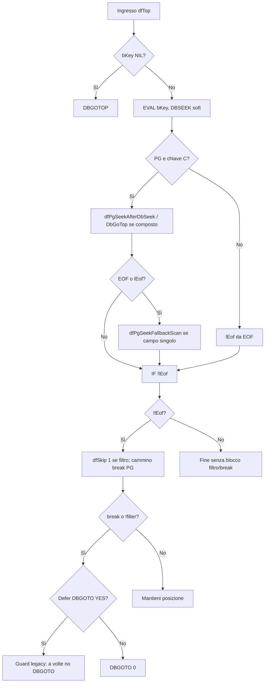

# PostgreSQL (PGDBE) — interventi sulla libreria Visual dBsee

Documento di riferimento per gli adattamenti introdotti nella libreria **Visual dBsee** (`libreria\src\`) al fine di allineare comportamento e prestazioni all’uso del driver **PGDBE** (PostgreSQL), in particolare per **stampe Crystal**, **query di stampa**, **dbLook**, **browse** e **file di configurazione dizionario**.

Ambito: **solo codice libreria**; le applicazioni host (es. PRESENZE) possono restare invariate salvo eventuali `dfSet` in `dbstart.ini` documentati nel file companion `PGDBE-dfSet-riferimento-rapido.md`.

**Runtime DacSession / PgUpsize (cartella `libreria\src\PG\`)** — I moduli `pgVdbIni`, `pgUpsizeConn`, `pgUpsize`, `pgUpsizeXml`, `pgDacSession` sono compilati con gotutto ( `static.base` / `dynamic.base`, stessa DLL/EXE di `BASE` dove risiede `DDUSE.PRG` ). L’attivazione PG resta legata a **`PgUpsize.ini`** sezione `[UPSIZE]` chiave **`PgActivateDbeSys`** (e override `dbstart.ini` / env), tramite **`dfPgRuntimeUsePostgres()`** in `pgUpsizeConn.prg`. In `DDUSE.PRG`, **`_dfPgDdRoutedSession`** esce subito con `NIL` se `dfPgRuntimeUsePostgres()` è falso, così senza opt-in non si interroga la DacSession. Lo stub `support\dfPgDdStub.prg` è rinominato in `.bak` perché i simboli PG sono forniti dai moduli reali in `PG\`.

**Ripristino dopo rigenera progetto** — `SOURCE\scripts\Restore-VdbPgAfterIdeRegen.ps1`: per **Make.xpj** legge le tre righe `dblang.lib` / `vdbsee1o.lib` / `vdbsee1s.lib` (tre righe `..\lib\*.lib` in `Make.xpj` / `RMAKEX1.TMP` verso `PRESENZE\lib` dopo gotutto+copy-dll, così i simboli `dfPg*` sono risolti; mirror opzionale in `Lib200` con `Copy-PresenzeLibsToVisualdBseeLib200.ps1`) e i commenti dopo `// #COD OIRMK4` da `VisualdBsee\ide\tmp\xbase\RMAKEX1.TMP` (template di generazione `.xpj` dell’IDE: copiando quel `tmp` nell’installazione principale, «Rigenera progetto» produce già lib e coda coerenti; lo script resta utile se l’IDE sovrascrive solo in parte). Blocco **OIEXE6** (sessione PG) in `INITPROC.TMP` tra `.inj exe6` e `dfInitScreenOff`. Il blocco **`/UPD`** con upsize PG resta nello script PowerShell (non nei tmp).

---

## Indice

1. [Riepilogo per modulo](#1-riepilogo-per-modulo)
2. [File e modifiche (dettaglio)](#2-file-e-modifiche-dettaglio)
3. [Correzione critica: seek su nome (DIPE / stampe)](#3-correzione-critica-seek-su-nome-dipe--stampe)
4. [Cache seek PG e ciclo di vita](#4-cache-seek-pg-e-ciclo-di-vita)
5. [Collegamenti](#5-collegamenti)
6. [Browse 1:n, `dfTop`, `dfSkip` e diagnostica PG](#6-browse-1n-dftop-dfskip-e-diagnostica-pg)

---

## 1. Riepilogo per modulo

| Area | File principali | Problema affrontato |
|------|-----------------|---------------------|
| Seek / ordini | `base\DFS.PRG`, `base\PGSEEK.PRG` | `DBSEEK` su PG non allineato al record “logico”; cache recno; **chiave indice complessa** (`PADR(UPPER(nome),…)`) mal interpretata; **fallback errato su `codice`** |
| Stampe (top/skip/break) | `base\DFSTA.PRG`, `base\DFSKIP.PRG`, `base\dfupdqry.prg`, `base\dfprncon.prg` | Report vuoti, `dfReportSKIP` fermo, `dfTop` in EOF, KEY/BREAK da query incompatibili con PG; **cache seek tra stampe** |
| Filtri query stampa | `base\DFQRYFLT.PRG`, `base\DFANY2ST.PRG` | NULL/NIL, confronti stringa/data/case, NBSP |
| Output Crystal / temp DBF | `xpp\DFCRWOUT.prg` | NULL SQL → NIL in lettura; scrittura record temporanei |
| dbLook | `base\DBLOOK.PRG` | Riposizionamento dopo `ORDSETFOCUS`; seek libero vuoto |
| Browse UI (1:n, listbox) | `s2\S2BROWSE.prg`, `s2\S2BRW.prg`, `base\TBSKIP.PRG`, `base\DFSKIP.PRG` | Listbox che si svuota o mostra una sola riga su PG; cambio master; `tbEval` / `dfTop` / `dfSkip` |
| Config dizionari | `base\DBCFGOPE.PRG` | Apertura DBDD/DBHLP con RDD default PG |

---

## 2. File e modifiche (dettaglio)

### 2.1 `base\PGSEEK.PRG`

Modulo condiviso per PG: rilevazione RDD, parsing chiave indice, verifica riga dopo seek, scan di fallback.

- **`dfPgRddIs( cRdd )`** — verifica se l’RDD corrente è PGDBE.
- **`dfPgOrdKeySingleField( cKeyExp )`** — ricava il **nome del campo** usato per verificare che il record corrente corrisponda al valore cercato.
  - Gestisce espressioni nidificate senza `+` nella chiave: ciclo che rimuove in sicurezza **`PADR`**, **`UPPER`**, **`LOWER`**, **`RTRIM`**, **`LTRIM`** (solo se l’argomento interno non contiene `(` né `,`), fino a ottenere l’identificatore campo (es. da `PADR(UPPER(nome),60)` → `nome`).
  - Le chiavi **composte** (presenza di `+`) restano non gestite e la funzione restituisce stringa vuota: in quel caso i chiamanti devono usare percorsi alternativi (es. `DBSEEK` senza verify sul campo singolo).
- **`dfPgSeekFieldValU`**, **`dfPgSeekIsPartialChr`**, **`dfPgSeekVerifyRow`**, **`dfPgSeekFallbackScan`**, **`dfPgSeekAfterDbSeek`** — allineamento posizione dopo `DBSEEK` (anche soft), confronti case-insensitive su campi carattere. **`dfPgSeekIsPartialChr`** resta usata in **`DFS.PRG`** per evitare un’ottimizzazione aggressiva quando il seek è più corto del campo; in **`dfPgSeekVerifyRow` / `dfPgSeekAfterDbSeek`** non si salta più il confronto solo perché “parziale” (campi `CHAR`/`VARCHAR` più larghi del codice dopo upsize PG → stessa descrizione su tutte le righe del browse).

### 2.2 `base\DFS.PRG` — `dfS()`

Per **PGDBE**, `dfS( nOrd, uSeek, … )` non si limita a `ORDSETFOCUS` + `DBSEEK`:

- Usa **`dfPgOrdKeySingleField( ORDKEY() )`** per sapere quale campo verificare sul record corrente.
- **Cache statica** (`sDfSSel`, `sDfSOrd`, `sDfSNam`, `sDfSWa`) + tabella hash (`dfHT*`) per memorizzare **RECNO** dopo seek verificato (`_dfSPgHtPut` / `_dfSPgHtTryGoto`). Riduce seek ripetuti sullo stesso ordine/alias.
- **Fallback `codice` condizionato:** se **`dfPgOrdKeySingleField`** restituisce vuoto e la tabella ha **`codice`** ma **non** ha il campo **`nome`** (tipico file **CODICI**), si imposta **`cFld := "codice"`**. Se esiste **`nome`** (tipico **DIPE**), **nessun** fallback: non si verifica più un seek lungo (nominativo) sul campo **codice** (causa dei valori a zero in stampa).
- Se **`dfPgOrdKeySingleField`** restituisce vuoto, ora **`sDfSNam`** viene **azzerato** (`""`) per non riusare in cache un campo di un ordine precedente.
- Se la ramificazione PG “avanzata” non applica, si ricade su **`DBSEEK( uSeek )`** come su altri RDD.

**`dfSPgSeekCacheFlush()`** — azzera hash seek e variabili statiche del contesto `dfS`. Deve essere richiamata tra contesti diversi (vedi `dfprncon.prg`).

### 2.3 `base\dfprncon.prg` — `dfPrnConfig()`

All’inizio di **`dfPrnConfig( aBuf )`** viene chiamata **`dfSPgSeekCacheFlush()`**, così ogni nuova configurazione stampa non eredita **cache seek** o **nome campo indice** dalla stampa precedente (sintomo: dati errati o incoerenti tra report consecutivi).

### 2.4 `base\DFSTA.PRG` — `dfReportTOP()`

Con **PGDBE**, se è attivo un **filtro/query di stampa** (`dfPrnArr()[REP_QRY_BLOCK] != NIL`), la procedura può chiamare **`dfTop( NIL, … )`** invece di **`dfTop( aVR[VR_KEY], … )`**, per evitare un `DBSEEK` sulla **KEY** del report che su PG può portare in **EOF** pur esistendo record che soddisfano `REP_QRY_*`.

- **Ripristino comportamento precedente:** `dfSet( "XbasePgReportTopUseKeyWithQry", "YES" )` in `dbstart.ini` (vedi riferimento rapido).

### 2.5 `base\dfupdqry.prg` — `dfUpdQryRep()`

Per tabelle **PG**, quando non è richiesto il comportamento legacy, **`bNewKey`** e **`bNewBreak`** passati a `dfUpdVR` vengono azzerati (`NIL` / `{|| .F.}`) perché la KEY/BREAK ottimizzata da `dfQryOpt` può essere pensata per **DBSEEK** sul master e su PG lasciare il master in stato non stampabile.

- **Ripristino:** `dfSet( "XbasePgReportKeepQueryKeyOpt", "YES" )`.

### 2.6 `base\DFSKIP.PRG` — `dfSkip()` e `dfTop()`

Questo modulo è centrale per **report** (`dfReportSKIP` → `dfSkip`) e per **browse / listbox** collegati a `W_KEY`, `W_FILTER`, `W_BREAK` (tramite **`base\TBSKIP.PRG`** → **`_TbBTop`** → **`dfTop`** e **`S2BROWSE.prg`** → **`SkipBlock`** → **`dfSkip`**).

#### 2.6.1 `FUNCTION dfSkip( n2Skip, bFilter, bBreak )`

**`LastRec()` su PG**

- Su PG **`LastRec()`** può restituire **0** anche con righe presenti (nessun conteggio fisico tipo DBF).
- Il ramo storico che trattava `LastRec()==0` come “nessun record” bloccava **`dfReportSKIP`**: report vuoti (“nulla da stampare”).
- **Condizione attuale:** si entra nel ramo “ferma skip” solo se  
  `(n2Skip == 0) .OR. (LastRec() == 0 .AND. !( dfPgRddIs(RDDNAME()) .AND. n2Skip != 0 ))`  
  così con PG e **`n2Skip != 0`** lo skip dei report continua.

**Skip positivo (`n2Skip > 0`) e `bBreak` (listbox 1:n)**

- Dopo ogni **`dbSkip(1)`** il codice controlla prima **`EOF()`** sull’alias (`(nAlias)->(Eof())`): in caso positivo ripristina **`nActRec`** ed esce dal ciclo interno (nessun incremento di `nSkipped`).
- Se **non** EOF ma **`EVAL(bBreak)`** è vero, su **DBF** il comportamento classico è: **`dbGoto(nActRec)`** e uscita → **`dfSkip` restituisce 0** per quell’unità di skip.
- Su **PGDBE**, l’ordine di navigazione del driver può far sì che il **primo** `dbSkip(1)` da un record valido porti subito su un record ancora “fuori gruppo” (`break` vero), pur esistendo più avanti altre righe valide per lo stesso master. In quel caso **`S2Browse:tbEval`** (che esce quando **`nSkip <> 1`**) mostrava **una sola riga** o interrompeva troppo presto la scansione.
- **Cammino PG (default attivo):** se PG e **`dfSet("XbasePgDfSkipWalkPastBreak") != "NO"`**, dopo il primo `dbSkip(1)` con `break` vero e non EOF si eseguono ulteriori **`DbSkip(1)`** in ciclo finché `break` è falso o si raggiunge EOF, con **tetto 100000** iterazioni per sicurezza. Se dopo il cammino si è ancora in `break` o EOF, si ripristina `nActRec` come prima.
- **Opt-out:** `dfSet("XbasePgDfSkipWalkPastBreak","NO")` disattiva il cammino (comportamento più “stretto”, utile se si vogliono evitare scansioni lunghe in contesti particolari).

**Skip negativo**

- Logica simmetrica per `n2Skip < 0` con `BOF` / `bBreak`; **non** è stato aggiunto il cammino “oltre break” in direzione negativa (se necessario si può estendere in seguito).

#### 2.6.2 `PROCEDURE dfTop( bKey, bFilter, bBreak )`

**Contesto di esecuzione**

- **`nAlias := SELECT()`** all’ingresso: **`dfTop`** deve essere chiamato con l’**alias del figlio** selezionato (come fa **`_TbBTop`** in **`TBSKIP.PRG`**: `(oTbr:W_ALIAS)->(dfTop(...))` dopo eventuale **`ORDSETFOCUS(oTbr:W_ORDER)`**).

**Fase 1 — `bKey == NIL`**

- **`DBGOTOP()`** sul workarea corrente; **`lEof`** non viene aggiornato esplicitamente in quel ramo (resta il default iniziale `.F.` del `LOCAL`, coerente col sorgente storico).

**Fase 2 — `bKey` valorizzato (tipico listbox 1:n)**

1. **`uSeekVal := EVAL(bKey)`** (es. valore del master `DIPE->nome`).
2. **`DBSEEK( uSeekVal, .T. )`** (soft) e **`lEof := EOF`**.
3. **Ramificazione PG** (`dfPgRddIs`):
   - Se **`uSeekVal`** è carattere non vuoto e **`dfPgOrdKeySingleField( ORDKEY() )`** non è vuoto: **`dfPgSeekAfterDbSeek`** sul campo dedotto e aggiornamento **`lEof`**.
   - Se la chiave d’ordine è **composta** (nessun campo singolo deducibile → stringa vuota da `dfPgOrdKeySingleField`) oppure seek fallito / EOF: **`DbGoTop()`** e nuovo **`lEof`**.

**Fase 3 — recupero EOF / `lEof` dopo seek (PG, solo con `bKey != NIL`)**

- Se **`EOF()` oppure `lEof`** è vero, ma la chiave è ancora **carattere** non vuota e esiste un **campo singolo** dall’ordine, viene chiamata **`dfPgSeekFallbackScan`** (`PGSEEK.PRG`: tentativo `DbSeek(PADR)` + eventuale scansione da testa tabella).
- Se il fallback trova una riga: **`lSeekOk := .T.`**, **`lEof := .F.`** così si rientra nel blocco successivo **`IF !lEof`** (altrimenti tutto il blocco che prepara filtro/break/`DBGOTO` veniva saltato → **listbox vuota** al cambio master anche con dati presenti).

**Fase 4 — solo se `!lEof`**

- Se il filtro non è soddisfatto sul record corrente: **`dfSkip( 1, bFilter, bBreak )`** (comportamento storico).
- **Cammino “oltre break” (PG):** stesse condizioni di **`dfSkip`** (PG, `bKey != NIL`, walk non disabilitato, non EOF, `EVAL(bFilter)` e `EVAL(bBreak)` veri): ciclo **`DbSkip(1)`** finché `break` o EOF (max 100000), per evitare di restare sulla riga del **dipendente precedente** dopo cambio master quando il seek ha lasciato il puntatore “nel mezzo” della navigazione logica.
- **Chiusura:** se **`EVAL(bBreak) .OR. !EVAL(bFilter)`**:
  - **Default:** **`DBGOTO(0)`** (allineamento a “nessun record figlio” coerente con DBF per liste 1:n con filtro `.T.` e break su relazione).
  - **Opt-in legacy stampa:** con **`dfSet("XbasePgDfTopDeferDbgoto0OnBreak","YES")`** e PG, se `!EOF` e filtro e break sono tutti `.T.`, **non** si esegue `DBGOTO(0)` (vecchio guard per **VR_BREAK** falso positivo in alcuni report).

#### 2.6.3 Collegamento con `S2Browse:tbEval`

- **`GoTopBlock`** → **`_TbBTop`** → **`dfTop( W_KEY, W_FILTER, W_BREAK )`** sul **`W_ALIAS`** del browse.
- **`SkipBlock`** → **`dfSkip( nRec, W_FILTER, W_BREAK )`** nello stesso alias.
- Il ciclo in **`tbEval`** continua finché **non** `( EOF .OR. EVAL(W_BREAK) .OR. (nSkip <> 1) )`, con **`nSkip := EVAL(SkipBlock, 1)`**. Quindi **`dfSkip` che restituisce 0** (o 1 solo quando atteso) governa quante righe “logiche” vengono attraversate: da qui l’importanza del cammino PG e del **`dfTop`** che non lascia EOF/`break` incoerenti dopo il cambio master.

#### 2.6.4 Limiti: ordine su chiave **composta**

- Se **`dfPgOrdKeySingleField( ORDKEY() )`** restituisce **stringa vuota** (espressione indice con **`+`**, più campi), **non** si dispone di un campo unico per **`dfPgSeekAfterDbSeek`** / **`dfPgSeekFallbackScan`** nella forma attuale.
- In quel caso **`dfTop`** usa **`DbGoTop()`** come partenza; se i dati richiedono comunque un posizionamento per chiave “logica” non espressa nell’ordine, può essere necessario un **ordine dedicato** sul figlio (es. solo `nome` o `nome+data` riducibile a strategia documentata) oppure un’estensione futura della libreria (es. deduzione campo da `bBreak` / `bKey` — non implementata genericamente per evitare supposizioni errate su tutte le app).

### 2.7 `base\DFQRYFLT.PRG` — `dfQryFlt()`

Costruzione dell’espressione di filtro per le query di stampa:

- **Date:** per confronti campo-data vs valore, uso di **`DTOS(...)`** su entrambi i lati dove serve evitare confronti sempre falsi con **CTOD** su tipi ODBC/PG.
- **Caratteri:** uso di **`dfAny2Str(...)`** per gestire **NULL → NIL/U**; normalizzazione **NBSP** (`CHR(160)`); per **`==`**: **`UPPER(ALLTRIM(STRTRAN(...)))`** su entrambi i lati; per **`=`** in contesto stringa: mapping verso confronto più stretto (**`==`**) dopo **`UPPER(RTRIM(...))`** per allineare padding/case/NULL tra PG e letterali di lookup.

### 2.8 `base\DFANY2ST.PRG` — `dfAny2Str()`

- Se il parametro è **`NIL`**, la funzione restituisce **`""`** prima dell’analisi `VALTYPE`, così i filtri e le espressioni generate non escludono righe per NULL SQL.

### 2.9 `xpp\DFCRWOUT.prg` — `dfCRWOut:output()`

Prima di memorizzare il valore nella cache verso il DBF temporaneo per Crystal:

- Se **`uVar`** è **`NIL`** o tipo **`U`** e **`aFie`** definisce il tipo colonna, si sostituisce con default tipizzato: **numerico → 0**, **data → `CTOD(SPACE(8))`**, **logico → .F.**, **altro → `""`**.

Allinea il comportamento al DBF dove i campi “vuoti” sono tipicamente già tipizzati, riducendo celle vuote o incoerenze in **`FIELDPUT`**.

### 2.10 `base\DBLOOK.PRG`

- **PG:** prima di **`ORDSETFOCUS( nInd )`**, se il record è valido, si salva **`RECNO()`** e dopo il ripristino indice si esegue **`DBGOTO( nPgSavRec )`**, perché su PG il cambio ordine può spostare il record corrente mentre il chiamante si aspetta ancora i valori dell’alias (es. `codici->codice`).
- **Seek libero vuoto** (`LT_FREE`, seek carattere vuoto, non sync, non ESC): opzionalmente **`DBGOTO(0)`** per non lasciare il cursore sul “primo” record visivo dopo seek fallito (codici fantasma in query/stampe).
  - Disabilitazione: `dfSet( "XbaseDbLookEofOnEmptyFreeSeek", "NO" )`.
- Ramificazioni PG riusano **`dfPgOrdKeySingleField`** / **`dfPgSeekVerifyRow`** / **`dfPgSeekFallbackScan`** come in `DFS`.

### 2.11 `s2\S2BROWSE.prg` — `S2Browse:tbReset()`

- **`tbReset` deve sempre chiamare `::Browser:tbReset()`** (che imposta `stable` e invoca **`tbTotal`**). Saltare l’intero `tbReset` su PG lasciava browse incoerente: colonne con block (es. **`codici->(dfS(...)), codici->C_DES`**) non decodificavano più correttamente.

### 2.11ter `s2\S2BRW.prg` — `S2XbpBrowser:tbTotal()`

- Su **PG**, con **`dfSet("XbaseBrowseFooterTotalsOnPG") != "YES"`**, si **omette** solo **`EVAL(::bEval, {|| ::dfTotalInc() })`** (scan tabella per totali footer), mantenendo **`dfColZero`** e **`tbColPut`**. Così l’apertura resta più veloce senza rompere **`tbReset`**. Per forzare il calcolo completo dei totali: **`XbaseBrowseFooterTotalsOnPG=YES`**.

### 2.12 `s2\S2BRW.prg` — `S2XbpBrowser:dfTotalInc()`

- In **`dfTotalInc`**, l’incremento del footer per colonne “tag” usa solo **`EVAL( oSub:WC_TOTALVALUE )`**: **`tbEval`** ha già posizionato il record; evitare un secondo **`EVAL` del block** (`WC_TOTALVALUE` era sommato due volte con logica precedente) riduce il costo per riga su browse con lookup (**`dfS`**) o calcoli pesanti su **PGDBE** (es. foglio presenze). I metodi correlati **`dfTAGTotalInc` / `dfTAGTotalDec`** mantengono la logica dedicata a **`COLUMN_TAG_COUNT`**.

### 2.13 `base\DBCFGOPE.PRG` — `dbCfgOpen()`

- Se l’**RDD di default** è **PGDBE**, per aprire i dizionari su disco (**DBDD**, **DBHLP**, **DBTABD**, **DBLOGIN**, **DBLKINF**) si forza temporaneamente **`DBFCDX`**, perché **`dfUseFile`** con driver PG non gestisce correttamente questi file DBF locali.

---

## 3. Correzione critica: seek su nome (DIPE / stampe)

Sintomo: stampe (es. riepilogo per codici / patent box) con **ore**, **retribuzione oraria** e importi a **zero** o vuoti su PostgreSQL, corretti su DBF.

**Causa radice (risolta):**

1. `ORDKEY()` per l’ordine su **nome** era spesso tipo **`PADR(UPPER(nome), L)`**.
2. **`dfPgOrdKeySingleField`** restituiva stringa vuota dopo il solo strip di `PADR`, lasciando `UPPER(nome)` con parentesi → uscita anticipata.
3. In **`dfS`**, con campo vuoto, scattava il fallback **`codice`**: la verifica confrontava il valore cercato (**nome**) con il campo **`codice`**, generando **match errato** o uso di **record sbagliato** su **`DIPE`**.

**Correzione:** parsing ricorsivo in **`dfPgOrdKeySingleField`** + **rimozione fallback `codice`** + **reset `sDfSNam`** quando il campo non è determinabile.

---

## 4. Cache seek PG e ciclo di vita

- La cache in **`DFS.PRG`** è **in-process** (STATIC + hash).
- Va trattata come **stato per sessione di lavoro sullo stesso alias/ordine**, non come cache globale tra applicazioni diverse.
- **`dfSPgSeekCacheFlush()`** deve essere invocata quando si cambia **contesto di stampa** o si vogliono evitare residui tra operazioni (implementato in **`dfPrnConfig`**).

---

## 5. Collegamenti

- **Riferimento rapido `dfSet` / `dbstart.ini`:** stesso folder, file **`PGDBE-dfSet-riferimento-rapido.md`** (tabella estesa, effetti collaterali e rischi per chiave).
- **Checklist riapplicazione fork:** **`PGDBE-checklist-riapplicazione.md`**.
- Documentazione Alaska su navigazione ISAM / PGDBE: URL citato nei commenti di `DFS.PRG` (smart order / OrdInfo).

---

## 6. Browse 1:n, `dfTop`, `dfSkip` e diagnostica PG

### 6.1 Sintomi tipici e dove guardare

| Sintomo | Ipotesi plausibile (PG) | Cosa verificare |
|---------|-------------------------|-----------------|
| Listbox **vuota** dopo cambio master, primo master ok | `EOF` / `lEof` dopo seek; non si entra in `IF !lEof` | Ordine figlio: `ORDKEY()` riducibile a **un campo**? (`dfPgOrdKeySingleField` non vuoto). Dati: esistono righe figlio per il nuovo master? |
| Listbox **una sola riga** | Primo `dfSkip(1)` torna **0** per `break` dopo un solo `dbSkip(1)` | Cammino `XbasePgDfSkipWalkPastBreak` disattivato per errore? (`=NO` globale) |
| Listbox con **righe di altri master** | `DBGOTO(0)` non eseguito quando serve | **`XbasePgDfTopDeferDbgoto0OnBreak=YES`** globale: ripristina default senza quel `dfSet` per le liste 1:n |
| Report “nulla da stampare” dopo fix browse | Conflitto seek KEY + query PG | `XbasePgReportTopUseKeyWithQry` / `XbasePgReportKeepQueryKeyOpt` (vedi §2.4–2.5 e doc `dfSet`) |

### 6.2 Flusso logico semplificato (`dfTop` con `bKey`)

### 6.3 File coinvolti (catena browse)

1. **`s2\S2BROWSE.prg`** — `Init`: `GoTopBlock`, `SkipBlock`, `tbEval`.
2. **`base\TBSKIP.PRG`** — **`_TbBTop`**: `ORDSETFOCUS` + **`dfTop`** sul **`W_ALIAS`**.
3. **`base\DFSKIP.PRG`** — **`dfTop`**, **`dfSkip`**.
4. **`base\PGSEEK.PRG`** — **`dfPgOrdKeySingleField`**, **`dfPgSeekAfterDbSeek`**, **`dfPgSeekFallbackScan`**, **`dfPgRddIs`**.

### 6.4 Prestazioni e sicurezza

- I cammini “oltre **`break`**” sono **tettati** (100000 passi) per evitare loop infiniti in caso di dati o block anomali.
- Su tabelle **molto grandi**, se il modello dati mette migliaia di record consecutivi “fuori relazione” rispetto al master, il costo per riga può crescere: in tal caso valutare **`XbasePgDfSkipWalkPastBreak=NO`** solo per quell’ambiente, accettando il rischio di liste incomplete se il problema è proprio la navigazione PG.

---

*Ultimo aggiornamento documento: allineato al sorgente in `VisualdBsee\libreria\src` (progetto PRESENZE / Visual dBsee).*
